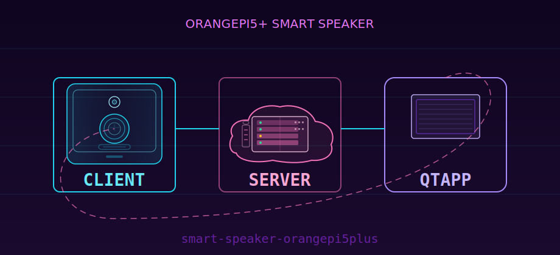

# smart-speaker-orangepi5plus

面向 **Orange Pi 5 Plus** 的智能音箱工程：板端负责播放与语音交互，可与自建服务端配合使用；也可在电脑上通过桌面端远程操作同一套服务。

## 应用做什么

- **板端（`smart-speaker-client`）**：本地或联网播放音乐、语音唤醒与对话相关能力；日常以板子为「音箱本体」运行。
- **服务端（`smart-speaker-server`）**：账号与曲库、设备/应用之间的转发与协调；需要联机搜歌、统一曲库或多端接入时部署在一台可达的机器上（可与板子同网或公网，按你的网络规划）。
- **桌面端（`smart-speaker-qtApp`）**：可选，通过同一服务端协议连接，用于在 PC 上控制或联调。

## 实现上怎么搭起来（谁依赖谁）

1. 板端可**单独**用本地音乐目录工作（U 盘/SD 挂载路径等在板端配置里指定）。
2. 要用**在线曲库、账号、多端转发**时，先部署并启动服务端，再在板端配置里填服务端地址。
3. 桌面端仅在需要时用 Qt 工程编译运行，并指向已启动的服务端。

首次运行会在各子工程下生成 **`data/`** 里的配置文件（路径与说明以对应目录文档为准）。

## 部署从哪开始

1. 克隆本仓库到开发机或板子：  
   `git clone https://github.com/LZJ-I/smart-speaker-orangepi5plus && cd smart-speaker-orangepi5plus`
2. **服务端**：按 [smart-speaker-server/README.md](smart-speaker-server/README.md) 安装依赖、初始化数据库与曲库目录、编译并启动；按该文档完成 `data/config` 中的必要配置。
3. **板端客户端**：按 [smart-speaker-client/README.md](smart-speaker-client/README.md) 安装系统依赖与资源（含 `assets` 生成说明）、编译、`player` 启动方式及 **`data/config/client.toml`** 中的本机曲库根目录、服务端地址等。
4. **Qt 桌面端**：按 [smart-speaker-qtApp/README.md](smart-speaker-qtApp/README.md) 构建并连接服务端。

各目录 README 中的命令、环境变量与排错说明以当前代码为准。板端专题文档索引：[smart-speaker-client/docs/smart-speaker-client-文档索引.md](smart-speaker-client/docs/smart-speaker-client-文档索引.md)；服务端接口与音乐链路见 `smart-speaker-server/docs/`。
