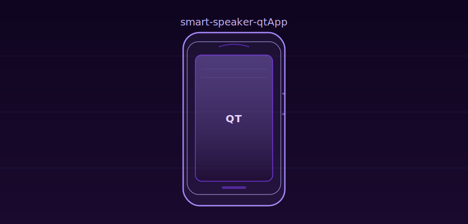

# smart-speaker-qtApp

基于 **Qt Widgets** 的桌面控制端，经 **TCP** 与 `smart-speaker-server` 通信（长度前缀 + JSON）。工程入口：`smart_speaker_app.pro`。

## 文件结构

| 文件 | 说明 |
|------|------|
| `smart_speaker_app.pro` | qmake 工程，依赖 `core` / `gui` / `network` / `widgets` |
| `main.cpp` | 程序入口 |
| `widget.*` / `widget.ui` | 主窗口 |
| `bind.*` / `bind.ui` | 绑定相关界面 |
| `player.*` / `player.ui` | 播放相关界面 |
| `socket.cpp` / `socket.h` | TCP 连接、定时重连、读写 JSON |

`smart_speaker_app.pro.user` 为 Qt Creator 本机 Kit/路径，换电脑通常需重新生成或调整。

